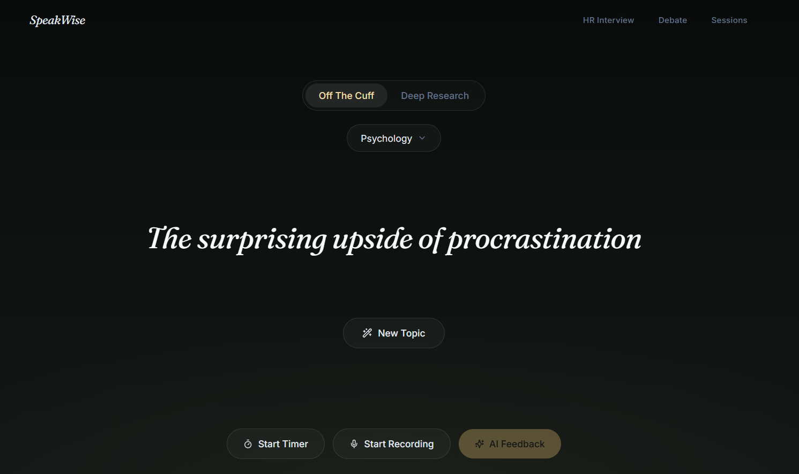
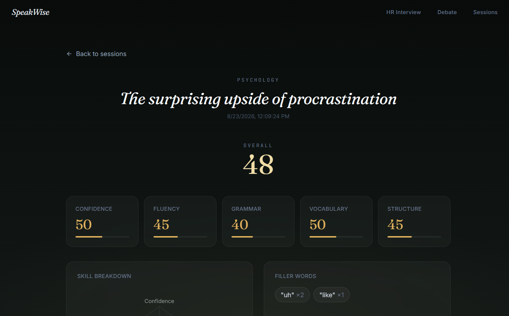
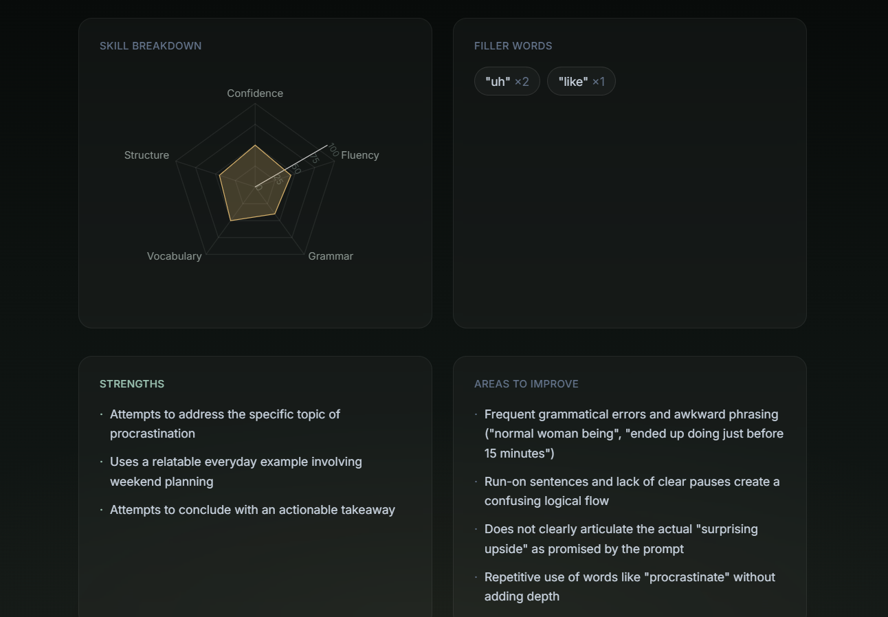
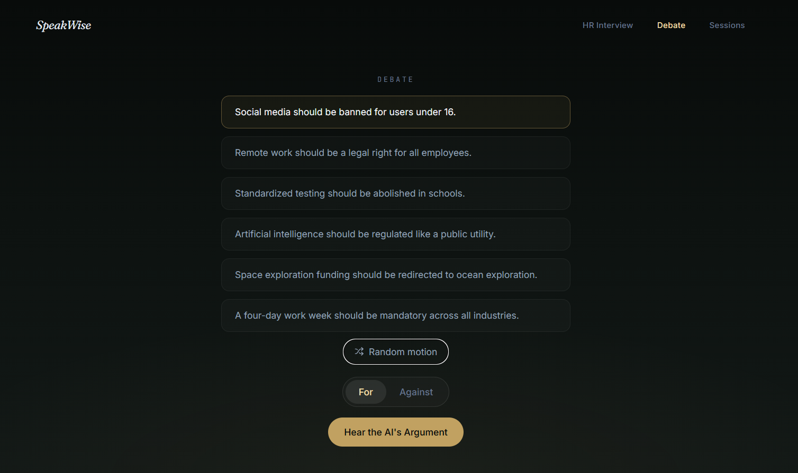
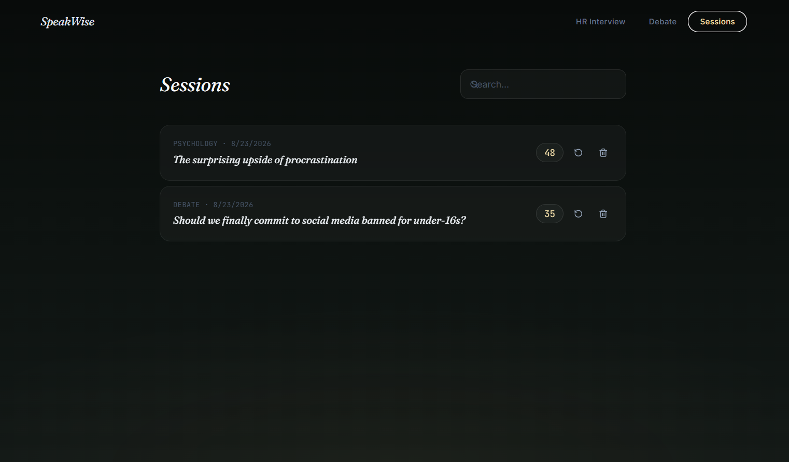

# SpeakWise AI

AI-Powered Communication Coaching Platform

SpeakWise AI is a modern communication coaching platform designed to help individuals improve public speaking, interview performance, debate skills, and overall communication confidence through deliberate practice and AI-powered feedback.

The platform combines speech transcription, communication analysis, personalized recommendations, and progress tracking to help users become more effective communicators over time.
---
## Application Preview

### Home Screen



### AI Analysis




### Debate Mode



### Session History


---

## Overview

Many people struggle with:

- Public speaking
- Interview preparation
- Debate and argumentation
- Communication confidence
- Speaking fluency
- Organizing thoughts clearly

SpeakWise AI provides a structured environment where users can practice speaking, receive actionable feedback, and continuously improve their communication skills.

Whether you are a student, job seeker, professional, content creator, or founder, SpeakWise AI helps transform communication practice into measurable progress.

---

## Key Features

### Random Topic Practice

Generate speaking prompts across multiple categories including:

- Communication
- Psychology
- Business
- Science
- Technology
- Ethics
- History
- Education
- Motivation
- Current Affairs

Topics are presented through a distraction-free interface designed for focused speaking practice.

---

### Off-The-Cuff Mode

Practice spontaneous communication with minimal preparation time.

Suitable for:

- Extempore speaking
- Group discussions
- Interview preparation
- Critical thinking exercises
- Communication confidence building

---

### Deep Research Mode

Prepare, research, and organize thoughts before delivering a structured response.

Suitable for:

- Presentations
- Technical explanations
- Academic discussions
- Public speaking competitions
- Business communication

---

### Speech Recording

Record responses directly within the browser using microphone access.

Features include:

- Audio recording
- Session management
- Transcript generation
- AI-powered evaluation workflow

---

### Speech-to-Text Transcription

Convert recorded speech into text using state-of-the-art speech recognition.

Current implementation:

- Groq Whisper Large V3 Turbo

Benefits:

- Fast transcription
- High accuracy
- Natural speech support
- Real-time workflow integration

---

### AI Communication Analysis

Analyze communication performance using Google Gemini.

Evaluation dimensions include:

- Confidence
- Fluency
- Grammar
- Vocabulary
- Clarity
- Structure
- Storytelling
- Persuasiveness

Generated insights include:

- Overall communication score
- Strengths
- Weaknesses
- Filler word detection
- Improvement recommendations

---

### Personalized AI Coaching

Beyond simple scoring, SpeakWise AI provides coaching-oriented feedback.

Examples:

**Problem**

Too many filler words

**Evidence**

14 filler words detected during the session

**Recommendation**

Pause briefly between key ideas

**Practice Exercise**

60-second pause training

**Expected Outcome**

Reduce filler word usage by 30%

---

### HR Interview Practice

Practice common interview scenarios including:

- Tell me about yourself
- Strengths and weaknesses
- Leadership experiences
- Conflict resolution
- Problem-solving situations
- Project explanations

Evaluation focuses on:

- Relevance
- Confidence
- Communication clarity
- Answer structure
- Professionalism

---

### Debate Practice

Develop reasoning and argumentation skills through AI-driven debates.

Workflow:

1. AI presents an argument
2. User delivers a rebuttal
3. AI evaluates the response
4. Detailed feedback is generated

Evaluation criteria:

- Logical reasoning
- Persuasiveness
- Counterarguments
- Communication effectiveness
- Debate structure

---

### Session History

Store and review previous speaking sessions.

Users can:

- Revisit transcripts
- Compare performance
- Track progress
- Re-analyze sessions
- Review feedback history

---

## User Experience

SpeakWise AI is designed around a simple philosophy:

> Practice first. Feedback second. Improvement always.

The interface is intentionally minimal to reduce distractions and help users focus on speaking.

Design principles:

- Clean layout
- Calm visual language
- Fast interactions
- Minimal cognitive load
- Mobile-friendly experience

---

## Technology Stack

### Frontend

- React 18
- TypeScript
- Vite
- Tailwind CSS
- Framer Motion
- React Router
- Recharts
- Web Audio API

### Backend

- Node.js
- Express.js

### Artificial Intelligence

#### Speech-to-Text

- Groq Whisper Large V3 Turbo

#### Communication Analysis

- Google Gemini

### Storage

Current MVP:

- Browser Local Storage

Planned:

- PostgreSQL
- Supabase Storage

---

## System Architecture

```text
User
 │
 ▼
React Frontend
 │
 ▼
Express Backend
 │
 ├──────────────► Groq Whisper
 │                    │
 │                    ▼
 │              Speech Transcript
 │
 └──────────────► Google Gemini
                      │
                      ▼
            Communication Analysis
                      │
                      ▼
                AI Feedback
```

---

## Project Structure

```text
speakwise-ai/
│
├── frontend/
│   ├── src/
│   │
│   ├── components/
│   ├── pages/
│   ├── hooks/
│   ├── context/
│   ├── services/
│   ├── data/
│   ├── types/
│   └── utils/
│
│
├── backend/
│   ├── routes/
│   ├── services/
│   ├── middleware/
│   └── server.js
│
├── docs/
│
└── README.md
```

---

## Local Installation

### Clone Repository

```bash
git clone https://github.com/yourusername/speakwise-ai.git

cd speakwise-ai
```

---

## Backend Setup

Navigate to backend:

```bash
cd backend
```

Install dependencies:

```bash
npm install
```

Create `.env` file:

```env
PORT=8080

GROQ_API_KEY=your_groq_api_key

GEMINI_API_KEY=your_gemini_api_key

GEMINI_MODEL=gemini-2.5-flash
```

Start backend:

```bash
npm run dev
```

Backend will run at:

```text
http://localhost:8080
```

---

## Frontend Setup

Open a second terminal:

```bash
cd frontend
```

Install dependencies:

```bash
npm install
```

Run development server:

```bash
npm run dev
```

Frontend will run at:

```text
http://localhost:5173
```

---

## API Keys

### Groq

Used for speech transcription.

Create an API key:

https://console.groq.com/keys

---

### Google Gemini

Used for communication analysis and debate evaluation.

Create an API key:

https://aistudio.google.com/app/apikey

---

## Current MVP Capabilities

- Random topic generation
- Public speaking practice
- Audio recording
- Speech transcription
- AI-powered analysis
- HR interview preparation
- Debate practice
- Session history
- Progress review

---

## Future Roadmap

### Authentication

- User registration
- Email login
- Google authentication
- User profiles

### Cloud Infrastructure

- PostgreSQL database
- Cloud storage
- Cross-device synchronization

### Progress Analytics

- Weekly reports
- Monthly reports
- Communication score trends
- Personalized growth tracking

### AI Coach

- Personalized learning plans
- Targeted communication exercises
- Weakness-focused practice sessions

### Real-Time Feedback

- Live transcription
- Instant filler-word detection
- Real-time coaching suggestions

### Mobile Applications

- Android application
- iOS application

### Community Features

- Daily speaking challenges
- Peer review system
- Discussion practice rooms

---

## Long-Term Vision

SpeakWise AI aims to become a comprehensive communication improvement platform.

The goal is not simply to evaluate speech but to help users develop:

- Confidence
- Clarity
- Persuasion
- Leadership communication
- Interview performance
- Public speaking ability

Through continuous practice and personalized feedback, users can systematically improve their communication skills over time.

---

## Author

Ajit Yadav

Built to help students, professionals, and lifelong learners improve communication skills through deliberate practice and AI-powered feedback.

